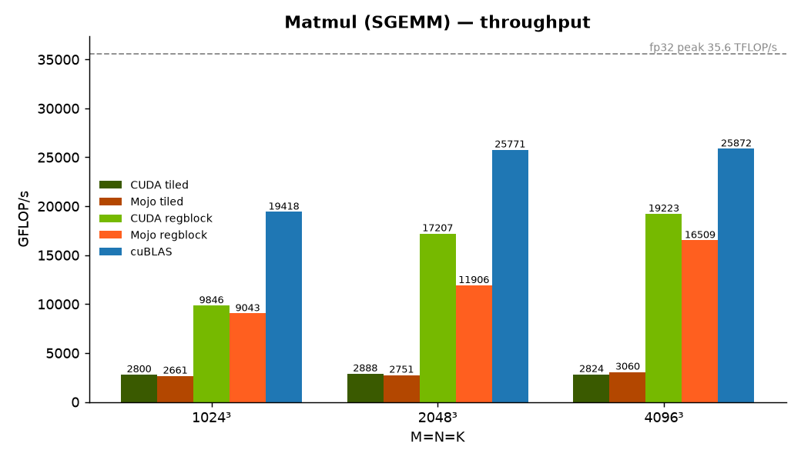
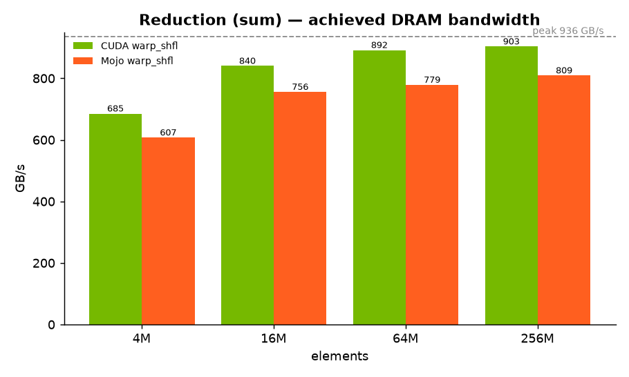
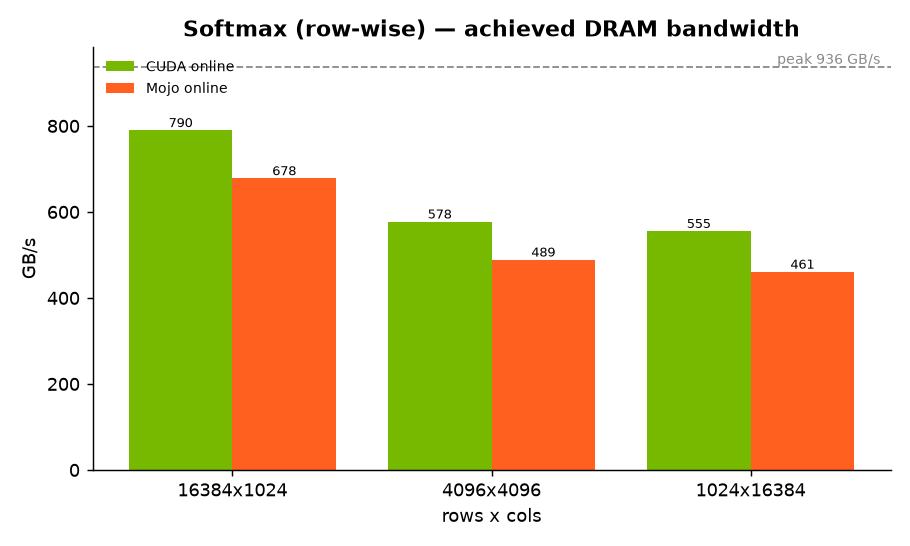

# mojo-cuda-ampere

A head-to-head **CUDA vs Mojo** GPU kernel shootout on **NVIDIA Ampere** (RTX 3090,
`sm_86`). Three kernels — **reduction**, **softmax**, **matmul** — each written twice,
optimized as far as is reasonable by hand, timed with the same methodology, and
plotted against the hardware roofline.

The question this answers: *how close does hand-written Mojo get to hand-written
CUDA (and to cuBLAS) on the same GPU, for the same algorithm?*

## Results (RTX 3090, CUDA 13.3, Mojo 1.0.0 / MAX 26.5.0)

| Kernel | Metric | Best CUDA | Best Mojo | Mojo / CUDA | Vendor ref |
|--------|--------|----------:|----------:|:-----------:|-----------:|
| reduction (256M f32) | GB/s     | **902** (warp_shfl) | 853 (warp_shfl) | 95% | — |
| softmax (16384×1024)  | GB/s     | **771** (online) | 674 (online) | 87% | — |
| matmul (1024³ f32)    | GFLOP/s  | **9 850** (regblock) | 9 040 (regblock) | 92% | cuBLAS 19 400 |
| matmul (4096³ f32)    | GFLOP/s  | **19 700** (regblock) | 16 500 (regblock) | 84% | cuBLAS 27 000 |

*(Single-run figures from `results/results.csv`; run-to-run variance is a few %.)*

Reduction and softmax are **memory-bound** — the ceiling is the 936 GB/s of GDDR6X,
and both languages land within ~5–13% of each other near it. Once the Mojo
reduction uses `float4`-vectorized loads (as the CUDA one does) it reaches **95%**
of CUDA and ~91% of the bus. Matmul is **compute-bound** — the hand-written
register-blocked kernels reach ~55% of the 35.6 TFLOP/s fp32 peak. Both the CUDA
and Mojo matmul now stage A/B through `float4`-vectorized loads; that closes the
Mojo gap to **92% at 1024³** and **~84% at 4096³**. The residual gap at large sizes
is double-buffering / instruction scheduling that cuBLAS and the tuned CUDA kernel
still do better — not memory movement.





## Layout

```
kernels/
  reduction/  { cuda/reduction.cu  mojo/reduction.mojo  README.md }
  softmax/    { cuda/softmax.cu    mojo/softmax.mojo    README.md }
  matmul/     { cuda/matmul.cu     mojo/matmul.mojo     README.md }
bench/        Makefile, run.sh (harness -> CSV), plot.py, profile.sh (ncu)
results/      results.csv (raw), *.png (charts), ncu/ (profiles)
docs/         methodology.md, roofline-3090.md
```

Every kernel program is self-contained: it runs its own size sweep, checks
correctness against a reference, and prints rows in one shared CSV schema
(`kernel,impl,variant,dtype,m,n,k,time_ms,gflops,gbytes_s,correct`). See
[docs/methodology.md](docs/methodology.md).

## Setup

Mojo runs on Linux; this repo is developed under WSL2 (Ubuntu) with the NVIDIA
driver exposing the 3090. You need **CUDA** (`nvcc`) and a **uv** environment with
**Mojo + MAX**.

```bash
# 1. Python env with Mojo + MAX (the max package ships the GPU host runtime and
#    the `layout` library; the bare `mojo` wheel alone cannot launch kernels).
uv sync

# 2. Build + run everything -> results/results.csv
./bench/run.sh

# 3. Charts
uv run bench/plot.py

# 4. (optional) Nsight Compute profiles — needs GPU counter permissions
sudo ./bench/profile.sh
```

Run a single side by hand:

```bash
nvcc -O3 -std=c++20 -arch=sm_86 -lcublas -o /tmp/mm kernels/matmul/cuda/matmul.cu && /tmp/mm --header
.venv/bin/mojo run kernels/matmul/mojo/matmul.mojo
```

## What "optimized" means here

- **reduction** — grid-stride load, warp-shuffle (`__shfl_down` / `warp.sum`) block
  reduction, one atomic/partial per block. Memory-bound; targets peak bandwidth.
- **softmax** — one block per row, single-pass **online softmax** (fused max+sum)
  with a warp-shuffle reduction over `(max, sum)` pairs, vs a naive three-pass
  baseline.
- **matmul** — 128×128 block tile, `BK=8`, an **8×8 register tile per thread**
  (256 threads/block), shared-memory staging. Compared against a simple 32×32
  tiled kernel and against **cuBLAS**.

Details and the per-kernel optimization story are in each `kernels/*/README.md`.
